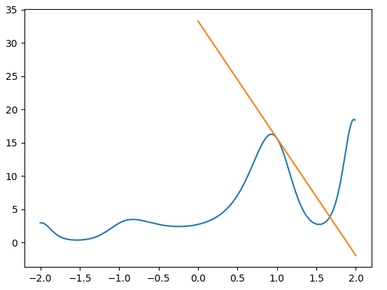

simple <100 lines library to automatically compute derivatives of functions in Python.


```python
import difffunctions as dff

# f(x) = sin(2x) + sin(x)
f = dff.sin(2 * dff.x**2) + dff.sin

# g(x) = e^(f(x) + 1)
g = dff.exp(f + 1)

print(g(1)) # see below

import matplotlib.pyplot as plt

domain = [x/100 for x in range(-200, 200)]
plt.plot(domain, [g(x) for x in domain])

a = 1
grad = g.d(a)
plt.plot([a-1, a+1], [g(a)-grad, g(a) + grad])
plt.show()
```
```
15.654656483837226
```
